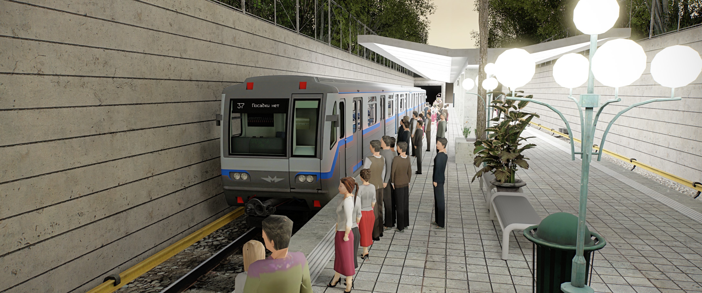

# ⚡ Garry's Mod RTX Launcher

**Самый простой и быстрый способ запустить Garry's Mod с реалистичным освещением и графикой нового поколения.**

 

---

## 🌟 Зачем нужен Garry's Mod RTX Launcher?

Установка графических модов и трассировки лучей для старых игр на движке Source обычно требует ручной перетасовки файлов, поиска нужных библиотек и постоянных настроек. **Наш лаунчер берет всю рутину на себя:**

✨ **Запуск в один клик**  
> Нажмите кнопку «Запуск» — лаунчер сам подготовит файлы Garry's Mod и активирует трассировку лучей.

🧙‍♂️ **Пошаговый мастер установки**  
> Простой помощник из 4 шагов при первом запуске — автоматически найдет игру и установит все необходимые RTX-фиксы.

🔄 **Автоматические обновления**  
> Лаунчер сам проверяет и скачивает свежие улучшения освещения (ассеты) и загружает собственные обновления «на лету».

⚙️ **Встроенные патчи**  
> Автоматически исправляет известные проблемы совместимости Garry's Mod и RTX Remix.

---

## 🎮 Как начать пользоваться?

1. **Скачайте** [актуальную версию лаунчера](https://github.com/RTX-Project/Gmod-RTX-Launcher/releases/latest/download/rtx-installer.exe).
2. Запустите скачанный файл `rtx-installer.exe`.
3. Пройдите простой **Мастер установки** (выберите папку с установленным Garry's Mod).
4. В открывшемся главном окне нажмите **«Запуск»** и наслаждайтесь реалистичной графикой с трассировкой лучей!

---

## 💻 Для разработчиков и энтузиастов

Если вы хотите принять участие в разработке лаунчера, понять как он работает изнутри, или создать свой форк, обязательно прочитайте наше [Руководство разработчика (README_DEV.md)](README_DEV.md). 

В нем подробно описаны:
* Архитектура C++ и ImGui
* Местоположение хардкодов и ссылок
* Автоматизация релизов через GitHub Actions

---

## ❤️ Благодарности

Создание этого проекта стало возможным благодаря труду многих талантливых людей и технологий:

* **NVIDIA** — Разработка платформы RTX Remix.
* **Xenthio** — Создание оригинального лаунчера, бинарных фиксов и ассетов для Garry's Mod.
* **sambow23** — Пропатченная версия RTX Remix для Gmod.
* **Omar Cornut** — Разработка библиотеки Dear ImGui.
* **Сообщество моддеров** — Патчи и исправления для стабильной игры.

 

`Created with ❤️ by the RTX Project Team & 🤖 AI (Google DeepMind)`

